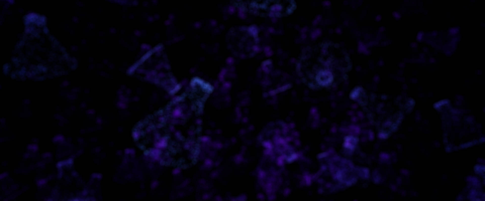

UE4Research Website Banner
==========================

This repository contains the Unreal Engine project used to create the banner image for the [UE4Research website](https://ue4research.org). The default scene contains a number of randomly placed Niagara particle systems, each of which spawns particles around the surface of a mesh resembling a conical flask. The material for the particles blends their colour between blue and purple based on pixel depth.

To create the banner, the camera was moved to a position facing an aesthetically pleasing spread of flasks and a screenshot taken using the [HighResShot console command](https://docs.unrealengine.com/en-us/Engine/Basics/Screenshots). The screenshot was then cropped and blurred in Photoshop using the Lens Blur filter. For reference, the finished banner looks like so:

The Unreal project itself is licensed under the MIT License, see the file [LICENSE](./LICENSE) for details.

The conical flask model was created by [Aidan Possemiers](https://github.com/ImmortalEmperor) and is licensed under a [Creative Commons Attribution 4.0 International License](http://creativecommons.org/licenses/by/4.0/). The finished banner is also covered under this license.
